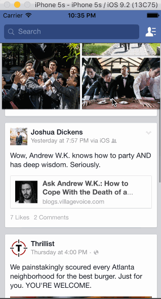

# Codepath Assignment #2

**Carousel Onboarding** Code Path Assignment 5

Submitted by: **Jisi Guo**

Time spent: **8** hours spent in total

## User Stories

Tapping on a photo in the news feed should expand the photo full screen.
Tapping the Done button should animate the photo back into its position in the news feed.
On scroll of the full screen photo, the background should start to become transparent, revealing the feed.
If the user scrolls a large amount and releases, the full screen photo should dismiss.

## Video Walkthrough 

Here's a walkthrough of implemented user stories:

GIF created with [LiceCap](http://www.cockos.com/licecap/).

## Notes

Describe any challenges encountered while building the app.

## License

    Copyright [yyyy] [name of copyright owner]

    Licensed under the Apache License, Version 2.0 (the "License");
    you may not use this file except in compliance with the License.
    You may obtain a copy of the License at

        http://www.apache.org/licenses/LICENSE-2.0

    Unless required by applicable law or agreed to in writing, software
    distributed under the License is distributed on an "AS IS" BASIS,
    WITHOUT WARRANTIES OR CONDITIONS OF ANY KIND, either express or implied.
    See the License for the specific language governing permissions and
    limitations under the License.
